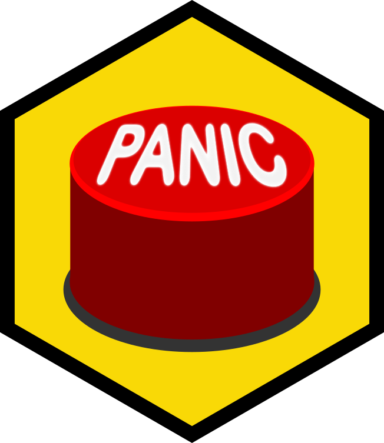

<!-- README.md is generated from README.Rmd. Please edit that file -->

# panic 

`panic` is an R package that that helps you know exactly when to panic.
<<<<<<< HEAD
Because most of the time, you don’t need to.
=======
Because most of the time, you don’t need to panic.
>>>>>>> 1fe34885bf19fe8ee5e80f5f09fadc7fff942cd9
